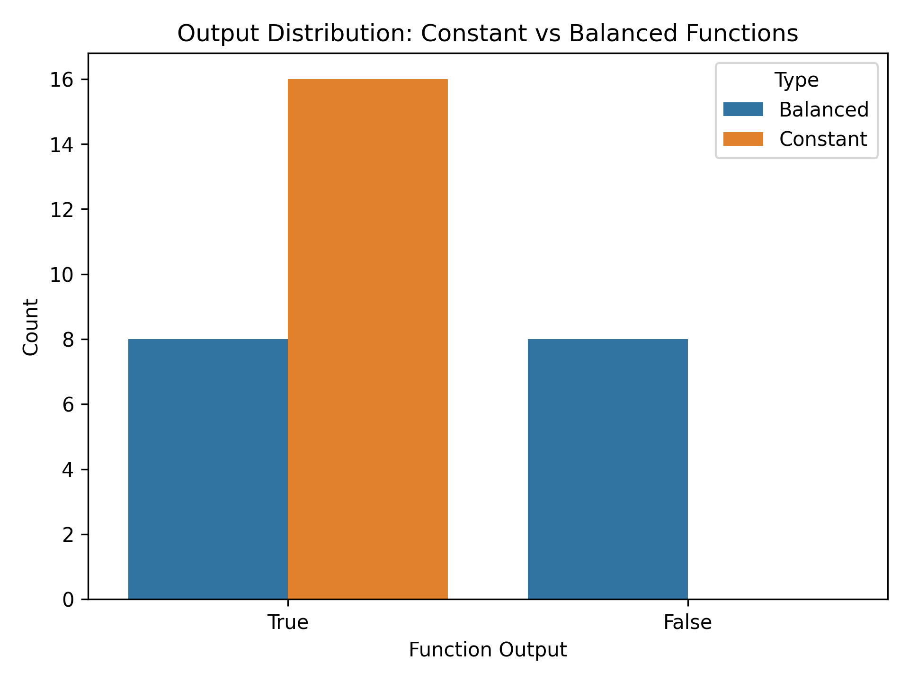
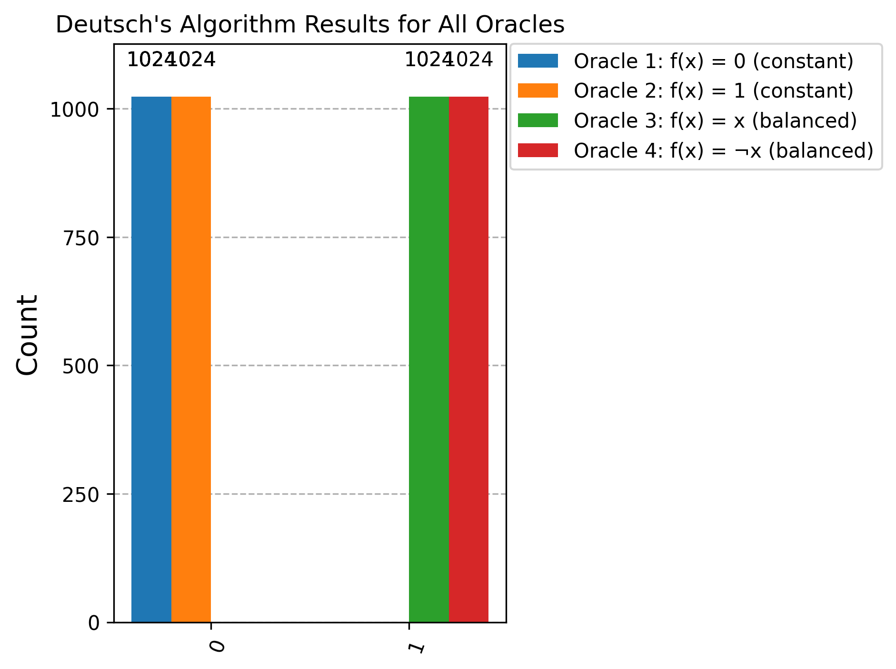
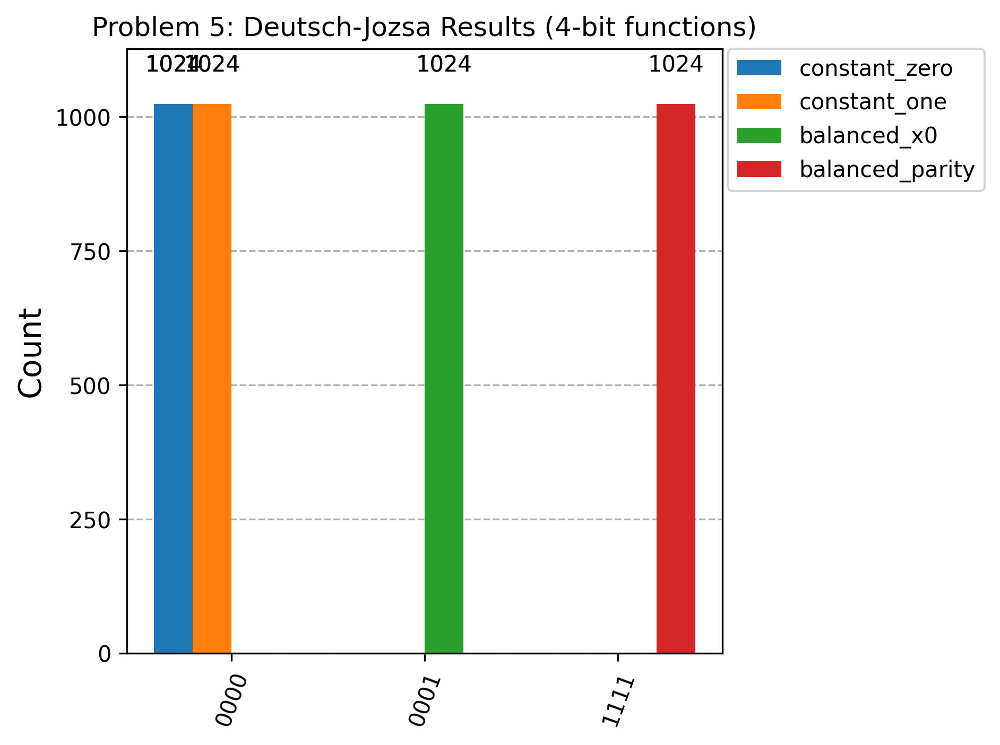

# Emerging Technologies Assignment

Author: Nora Keavney  
Student ID: G00415845

This repository contains the solutions for the Emerging Technologies assessment on classical versus quantum approaches to Boolean function classification.

## Repository Purpose

The notebook [problems.ipynb](problems.ipynb) completes all five required problems:

1. Generate random constant/balanced 4-bit Boolean functions.
2. Classically determine whether a function is constant or balanced.
3. Build single-bit quantum oracles for Deutsch's problem.
4. Implement Deutsch's algorithm and test all four single-bit oracles.
5. Scale to Deutsch-Jozsa for 4-bit functions and verify classifications.

## Repository Structure

- [problems.ipynb](problems.ipynb): Main submission notebook.
- [requirements.txt](requirements.txt): Python dependencies.
- [img](img): Diagram assets used in the notebook.

## Quick Start

Run these commands from a terminal:

```bash
git clone https://github.com/norakeavney/emerging-technologies.git
cd emerging-technologies
pip install -r requirements.txt
jupyter notebook problems.ipynb
```

## Reproducibility Notes

- The notebook is designed to run from top to bottom.
- For final verification before submission:
1. Restart the kernel.
2. Run all cells in order.
3. Confirm there are no execution errors.
4. Confirm execution counts are sequential.

## Problem Summary

### Problem 1: Generating Random Boolean Functions

Implemented `random_constant_balanced`, which returns a random 4-input Boolean function guaranteed to be either:

- constant: all 16 outputs identical, or
- balanced: exactly 8 True and 8 False outputs.

The implementation uses a truth-table style construction for correctness.

### Problem 2: Classical Testing for Function Type

Implemented classical function-type testing and discussed efficiency:

- a complete check that guarantees correctness,
- an early-stop variant that can exit as soon as both output values are observed.

Under the assignment promise (function is either constant or balanced), worst-case certainty requires 9 evaluations; without that promise, a full 16-input check is the safe general approach.

### Problem 3: Quantum Oracles

Built all four single-input oracles used in Deutsch's problem:

- f(x) = 0
- f(x) = 1
- f(x) = x
- f(x) = not x

Each oracle is implemented as a reversible circuit using X and CNOT gates and validated through simulation.

### Problem 4: Deutsch's Algorithm with Qiskit

Implemented Deutsch's algorithm and demonstrated it on all four oracles.

The notebook shows that one oracle query is sufficient to classify the function as constant or balanced via interference after Hadamard transforms.

### Problem 5: Scaling to Deutsch-Jozsa

Implemented a 4-input Deutsch-Jozsa workflow with:

- classical function definitions,
- oracle construction from classical truth behavior,
- a shared circuit builder reused from Problem 4,
- simulation and classification for both constant functions and two balanced functions.

Observed results match expected behavior:

- constant functions map to all-zero measured input register,
- balanced functions map to non-zero measured input register.

## Final Result Figures

### Problem 2: Classical Output Distribution



### Problem 4: Deutsch Algorithm Results



### Problem 5: Deutsch-Jozsa Results



## Environment

- Python 3.x
- Qiskit
- Qiskit Aer
- Jupyter Notebook
- Standard scientific Python tools (NumPy, Pandas, Matplotlib, Seaborn)

See [requirements.txt](requirements.txt) for the exact package list.

## References

The notebook contains per-problem references in the relevant sections so each source is contextualized where used.
